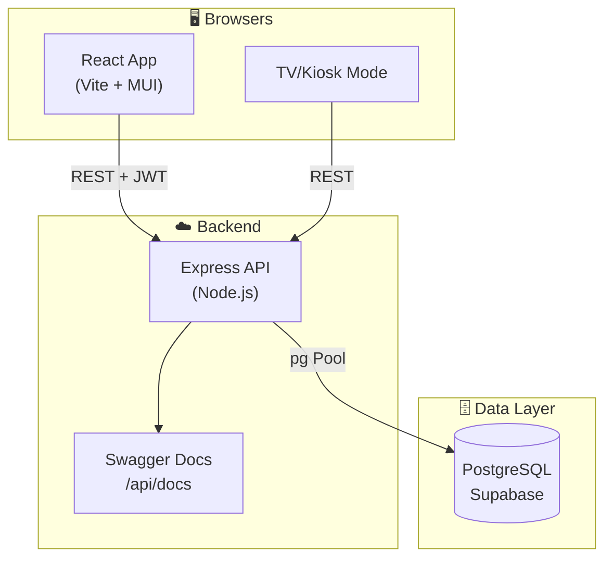
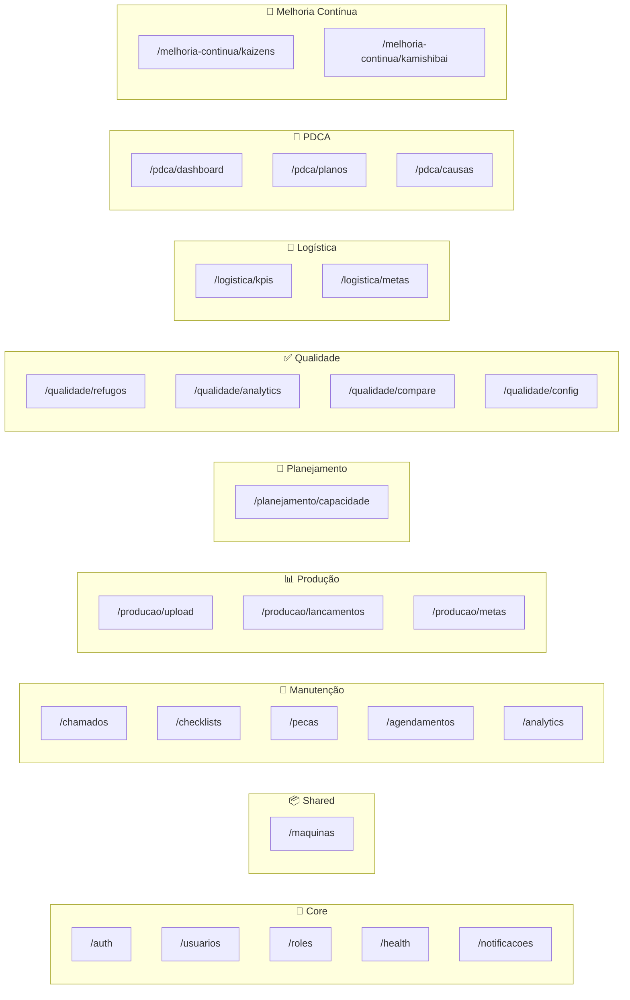
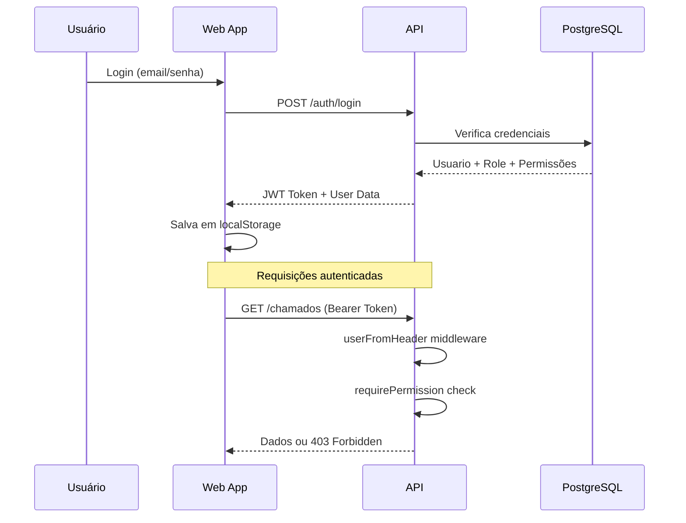

# Arquitetura da Plataforma TPM Manutenção

> **Última atualização**: Março 2026

## 1. Visão Geral

A plataforma TPM Manutenção é um sistema fullstack para gestão de manutenção industrial, controle de produção e planejamento de capacidade. Construída como um **monorepo** gerenciado com **pnpm workspaces**.



---

## 2. Stack Tecnológico

| Camada | Tecnologia | Detalhes |
|--------|------------|----------|
| **Frontend** | React 18 + TypeScript | Vite como bundler |
| **UI Library** | Material UI (MUI) | Componentes padronizados |
| **State** | React Hooks + Context | Sem Redux |
| **i18n** | react-i18next | 10 idiomas suportados |
| **Backend** | Express + TypeScript | Node.js runtime |
| **Database** | PostgreSQL | Hospedado no Supabase |
| **Auth** | JWT + Custom Middleware | Sem dependência direta do Supabase Auth |
| **Docs** | Swagger/OpenAPI | Auto-gerado via JSDoc |

---

## 3. Estrutura do Monorepo

```
manutencao/
├── apps/
│   ├── api/                 # Backend Express
│   │   ├── src/
│   │   │   ├── routes/      # Controllers por módulo
│   │   │   ├── middlewares/ # Auth, Permissions
│   │   │   ├── utils/       # Helpers
│   │   │   └── config/      # Env, DB config
│   │   └── migrations/      # SQL migrations
│   │
│   └── web/                 # Frontend React
│       └── src/
│           ├── components/  # Componentes globais
│           ├── features/    # Módulos de negócio
│           ├── hooks/       # Custom hooks
│           ├── locales/     # Traduções i18n
│           └── services/    # API clients
│
├── packages/
│   └── shared/              # Tipos TypeScript compartilhados
│
├── docs/                    # Documentação
└── .agent/                  # Contexto para AI agents
```

---

## 4. Módulos de Negócio

### Backend (API Routes)



### Frontend (Features)

| Módulo | Pasta | Descrição |
|--------|-------|-----------|
| **Manutenção** | `features/manutencao/` | Chamados, Checklists, Máquinas, Analytics |
| **Produção** | `features/producao/` | Dashboard, Uploads, Lançamentos, Colaboradores |
| **Planejamento** | `features/planejamento/` | Capacidade, Configurações |
| **Qualidade** | `features/qualidade/` | Dashboard, Lançamentos, Analítico, Comparativo, Config |
| **Logística** | `features/logistica/` | Dashboard de logística, KPIs |
| **PDCA** | `features/pdca/` | Dashboard consolidado, Planos, Causas |
| **Melhoria Contínua** | `features/melhoria-continua/` | Kaizens, Checklists Kamishibai, Gestão visual e Histórico |
| **Usuários** | `features/usuarios/` | Gestão de usuários e roles |
| **Configurações** | `features/configuracoes/` | Notificações, Settings globais |
| **TV/Kiosk** | `features/tv/` | Dashboards para monitores |

---

## 5. Fluxo de Autenticação



---

## 6. Sistema de Permissões

O sistema utiliza **RBAC com granularidade por feature**. Ver [PERMISSIONS.md](PERMISSIONS.md) para detalhes.

**Fluxo resumido:**
1. Usuário possui um `role` (ex: Operador, Gerente, Admin)
2. Role define permissões padrão por `pageKey`
3. Backend protege rotas com `requirePermission(pageKey, level)`
4. Frontend condiciona UI com `usePermissions()` hook

---

## 7. Internacionalização

A plataforma suporta **10 idiomas**:
- 🇧🇷 Português (pt)
- 🇺🇸 English (en)
- 🇪🇸 Español (es)
- 🇫🇷 Français (fr)
- 🇩🇪 Deutsch (de)
- 🇮🇹 Italiano (it)
- 🇯🇵 日本語 (ja)
- 🇰🇷 한국어 (ko)
- 🇨🇳 简体中文 (zh-Hans)
- 🇹🇼 繁體中文 (zh-Hant)

**Arquivos**: `apps/web/src/locales/{lang}/common.json`

---

## 8. Datas e Fuso Horário

### Convenção: UTC no banco, Brasília no display

| Camada | Comportamento |
|--------|--------------|
| **Banco de dados** | Todos os timestamps são `TIMESTAMPTZ DEFAULT timezone('utc', now())` — armazenados em UTC |
| **API (lógica de negócio)** | Conversões explícitas para `America/Sao_Paulo` quando necessário (ex: determinação de turno) |
| **Frontend (display)** | Sempre renderizado em `America/Sao_Paulo` via utilitário centralizado |

### Utilitário de datas (`apps/web/src/shared/utils/dateUtils.ts`)

**Nunca** use `new Date().toLocaleString()` ou `.toLocaleDateString()` diretamente — em ambientes com timezone UTC (containers, servidores de CI), o horário aparecerá 3h adiantado para usuários em Brasília.

**Sempre** use as funções do utilitário:

```typescript
import { formatDate, formatDateTime, formatDateTimeShort } from '../../../shared/utils/dateUtils';

formatDate(value)          // DD/MM/AAAA
formatDateTime(value)      // DD/MM/AAAA, HH:MM:SS
formatDateTimeShort(value) // DD/MM/AAAA, HH:MM
```

---

## 9. Segurança

| Camada | Implementação |
|--------|---------------|
| **Headers HTTP** | Helmet com CSP, HSTS (1 ano), `X-Frame-Options: DENY`, `Referrer-Policy: no-referrer` |
| **Rate Limiting** | `express-rate-limit` em rotas sensíveis (login, `/auth/me`) |
| **Hashing** | bcrypt com 12 rounds (força mínima recomendada) |
| **SSL** | `rejectUnauthorized: true` em produção; desabilitado apenas em dev |
| **Permissões** | Todas as rotas autenticadas exigem `requirePermission` — nenhuma rota exposta sem verificação |

---

## 10. Ambientes

| **Production** | Fly.io (Primary) / Render (Fallback) | Produção |
| **Database** | Supabase | Instância única |

---

## 11. Alta Disponibilidade (API Fallback)

Para garantir a resiliência contra bloqueios de rede (como Cisco Umbrella/OpenDNS) ou indisponibilidade do provedor principal, o frontend implementa uma estratégia de **Fallback Automático**.

| Componente | Detalhes |
|------------|----------|
| **Principal (Primary)** | [Fly.io](https://fly.io) — Prioritário por performance. |
| **Reserva (Fallback)** | [Render](https://render.com) — Acionado em caso de falha de infraestrutura. |

### Mecanismo de Funcionamento:
1. **Detecção**: Toda requisição ao primário tem um timeout de **3 segundos**.
2. **Fallback**: Se houver timeout, erro de rede ou erro de gateway (502/503/504), a requisição é repetida automaticamente no Render.
3. **Persistência**: Uma vez ativado, o fallback é mantido no `sessionStorage` para evitar novos timeouts na sessão atual.
4. **Recuperação (Recovery)**: A cada **10 minutos**, o sistema realiza um *silent probe* (`GET /health`) no Fly.io. Se houver sucesso, a aplicação retorna automaticamente para a rota principal.
5. **Logs**: Ativações de fallback e restaurações são registradas no console do browser para auditoria.

---

---

## Links Relacionados

- [Sistema de Permissões](PERMISSIONS.md)
- [Padrões de API](API.md)
- [Contexto para Agentes](CONTEXT.md)
