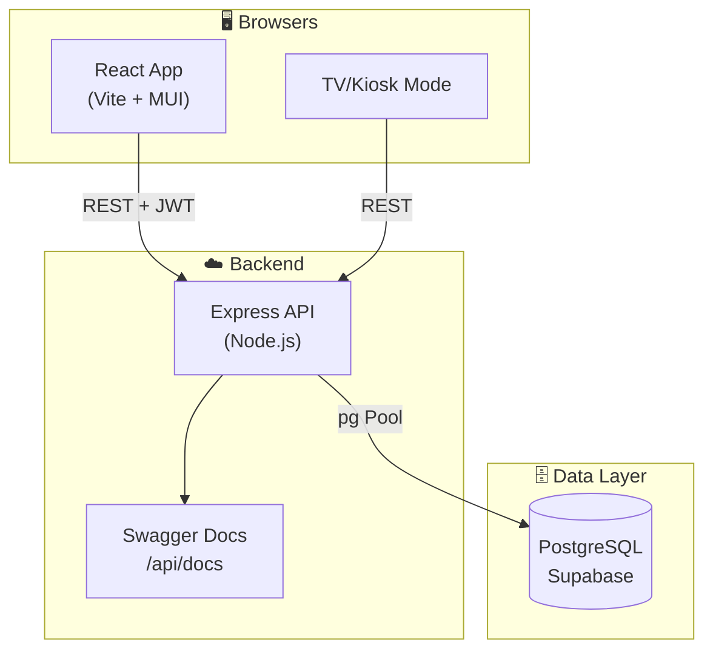
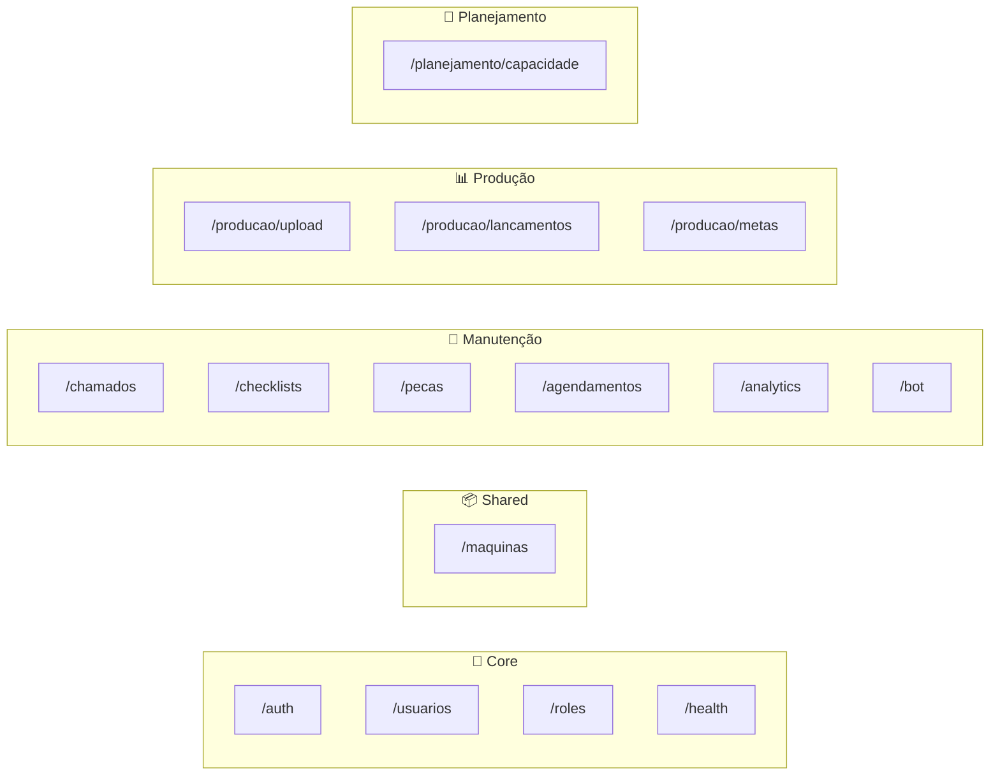
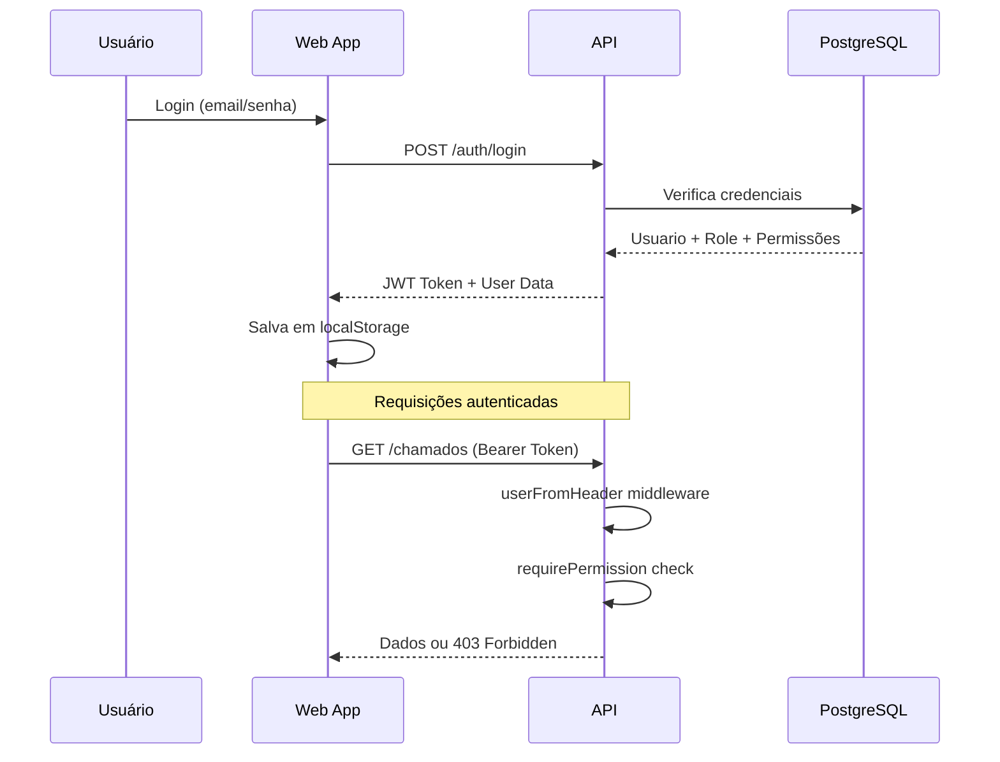

# Arquitetura da Plataforma TPM Manutenção

> **Última atualização**: Janeiro 2026

## 1. Visão Geral

A plataforma TPM Manutenção é um sistema fullstack para gestão de manutenção industrial, controle de produção e planejamento de capacidade. Construída como um **monorepo** gerenciado com **pnpm workspaces**.



---

## 2. Stack Tecnológico

| Camada | Tecnologia | Detalhes |
|--------|------------|----------|
| **Frontend** | React 18 + TypeScript | Vite como bundler |
| **UI Library** | Material UI (MUI) | Componentes padronizados |
| **State** | React Hooks + Context | Sem Redux |
| **i18n** | react-i18next | 10 idiomas suportados |
| **Backend** | Express + TypeScript | Node.js runtime |
| **Database** | PostgreSQL | Hospedado no Supabase |
| **Auth** | JWT + Custom Middleware | Sem dependência direta do Supabase Auth |
| **Docs** | Swagger/OpenAPI | Auto-gerado via JSDoc |

---

## 3. Estrutura do Monorepo

```
manutencao/
├── apps/
│   ├── api/                 # Backend Express
│   │   ├── src/
│   │   │   ├── routes/      # Controllers por módulo
│   │   │   ├── middlewares/ # Auth, Permissions
│   │   │   ├── utils/       # Helpers
│   │   │   └── config/      # Env, DB config
│   │   └── migrations/      # SQL migrations
│   │
│   └── web/                 # Frontend React
│       └── src/
│           ├── components/  # Componentes globais
│           ├── features/    # Módulos de negócio
│           ├── hooks/       # Custom hooks
│           ├── locales/     # Traduções i18n
│           └── services/    # API clients
│
├── packages/
│   └── shared/              # Tipos TypeScript compartilhados
│
├── docs/                    # Documentação
└── .agent/                  # Contexto para AI agents
```

---

## 4. Módulos de Negócio

### Backend (API Routes)



### Frontend (Features)

| Módulo | Pasta | Descrição |
|--------|-------|-----------|
| **Manutenção** | `features/manutencao/` | Chamados, Checklists, Máquinas, Analytics |
| **Produção** | `features/producao/` | Dashboard, Uploads, Lançamentos |
| **Planejamento** | `features/planejamento/` | Capacidade, Configurações |
| **Usuários** | `features/usuarios/` | Gestão de usuários e roles |
| **Configurações** | `features/configuracoes/` | Settings globais |
| **TV/Kiosk** | `features/tv/` | Dashboards para monitores |

---

## 5. Fluxo de Autenticação



---

## 6. Sistema de Permissões

O sistema utiliza **RBAC com granularidade por feature**. Ver [PERMISSIONS.md](PERMISSIONS.md) para detalhes.

**Fluxo resumido:**
1. Usuário possui um `role` (ex: Operador, Gerente, Admin)
2. Role define permissões padrão por `pageKey`
3. Backend protege rotas com `requirePermission(pageKey, level)`
4. Frontend condiciona UI com `usePermissions()` hook

---

## 7. Internacionalização

A plataforma suporta **10 idiomas**:
- 🇧🇷 Português (pt)
- 🇺🇸 English (en)
- 🇪🇸 Español (es)
- 🇫🇷 Français (fr)
- 🇩🇪 Deutsch (de)
- 🇮🇹 Italiano (it)
- 🇯🇵 日本語 (ja)
- 🇰🇷 한국어 (ko)
- 🇨🇳 简体中文 (zh-Hans)
- 🇹🇼 繁體中文 (zh-Hant)

**Arquivos**: `apps/web/src/locales/{lang}/common.json`

---

## 8. Ambientes

| Ambiente | URL | Uso |
|----------|-----|-----|
| **Development** | `localhost:5173` (web), `localhost:3000` (api) | Desenvolvimento local |
| **Production** | Vercel / Cloud Run | Produção |
| **Database** | Supabase | Instância única |

---

## Links Relacionados

- [Sistema de Permissões](PERMISSIONS.md)
- [Padrões de API](API.md)
- [Contexto para Agentes](./../.agent/BEHAVIOR.md)
