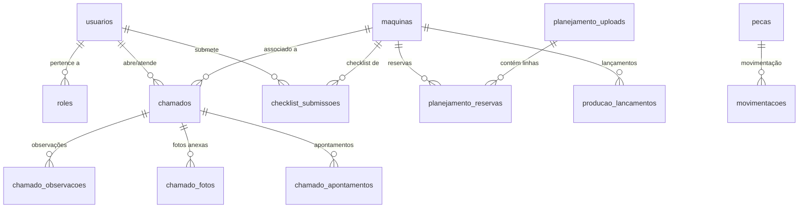

# Schema do Banco de Dados

> **Engine**: PostgreSQL (hospedado no Supabase)  
> **Timezone**: `America/Sao_Paulo`

---

## 1. Diagrama Entidade-Relacionamento

---

## 2. Tabelas Principais

### Core (Autenticação e Autorização)

#### `usuarios`
Usuários do sistema com credenciais e papel.

| Coluna | Tipo | Descrição |
|--------|------|-----------|
| `id` | UUID | PK |
| `nome` | VARCHAR | Nome completo |
| `email` | VARCHAR | Email único (login) |
| `usuario` | VARCHAR | Username alternativo |
| `senha_hash` | VARCHAR | Hash da senha (bcrypt) |
| `matricula` | VARCHAR | Matrícula funcional |
| `role` | VARCHAR | Papel legado (ex: 'operador') |
| `role_id` | UUID | FK → roles.id |
| `funcao` | VARCHAR | Cargo/função |
| `created_at` | TIMESTAMP | Data de criação |

#### `roles`
Papéis com permissões granulares.

| Coluna | Tipo | Descrição |
|--------|------|-----------|
| `id` | UUID | PK |
| `nome` | VARCHAR | Nome do papel (ex: 'Gerente') |
| `descricao` | TEXT | Descrição |
| `permissoes` | JSONB | Mapa de permissões por pageKey |
| `is_system` | BOOLEAN | Se é role do sistema (não editável) |

---

### Manutenção

#### `maquinas`
Cadastro de máquinas/ativos.

| Coluna | Tipo | Descrição |
|--------|------|-----------|
| `id` | UUID | PK |
| `nome` | VARCHAR | Nome da máquina |
| `codigo` | VARCHAR | Código identificador |
| `parent_id` | UUID | FK → maquinas.id (hierarquia) |
| `escopo_producao` | BOOLEAN | Participa de produção |
| `escopo_planejamento` | BOOLEAN | Participa de planejamento |
| `aliases_producao` | TEXT[] | Aliases para match de produção |
| `aliases_planejamento` | TEXT[] | Aliases para match de planejamento |
| `capacidade_horas` | DECIMAL | Horas de capacidade |

#### `chamados`
Sistema de chamados de manutenção.

| Coluna | Tipo | Descrição |
|--------|------|-----------|
| `id` | UUID | PK |
| `maquina_id` | UUID | FK → maquinas.id |
| `operador_id` | UUID | FK → usuarios.id (quem abriu) |
| `manutentor_id` | UUID | FK → usuarios.id (técnico responsável) |
| `situacao` | VARCHAR | Status: Aberto, Em Andamento, Concluído |
| `prioridade` | VARCHAR | Alta, Média, Baixa |
| `tipo_manutencao` | VARCHAR | Corretiva, Preventiva |
| `descricao` | TEXT | Descrição do problema |
| `solucao` | TEXT | Solução aplicada |
| `data_abertura` | TIMESTAMP | Quando foi aberto |
| `data_inicio` | TIMESTAMP | Quando iniciou atendimento |
| `data_conclusao` | TIMESTAMP | Quando foi concluído |
| `tempo_parada` | INTERVAL | Tempo de parada |

#### `chamado_observacoes`
Histórico de observações/comentários em chamados.

| Coluna | Tipo | Descrição |
|--------|------|-----------|
| `id` | UUID | PK |
| `chamado_id` | UUID | FK → chamados.id |
| `usuario_email` | VARCHAR | Autor |
| `texto` | TEXT | Comentário |
| `created_at` | TIMESTAMP | Data |

#### `chamado_fotos`
Fotos anexadas a chamados.

| Coluna | Tipo | Descrição |
|--------|------|-----------|
| `id` | UUID | PK |
| `chamado_id` | UUID | FK → chamados.id |
| `storage_path` | VARCHAR | Caminho no storage |

#### `checklist_submissoes`
Submissões de checklists diários.

| Coluna | Tipo | Descrição |
|--------|------|-----------|
| `id` | UUID | PK |
| `maquina_id` | UUID | FK → maquinas.id |
| `operador_id` | UUID | FK → usuarios.id |
| `turno` | VARCHAR | 1º, 2º, 3º |
| `respostas` | JSONB | Respostas do checklist |
| `created_at` | TIMESTAMP | Data/hora da submissão |

#### `pecas`
Cadastro de peças de reposição.

| Coluna | Tipo | Descrição |
|--------|------|-----------|
| `id` | UUID | PK |
| `codigo` | VARCHAR | Código da peça |
| `nome` | VARCHAR | Nome |
| `categoria` | VARCHAR | Categoria |
| `estoque_atual` | INTEGER | Quantidade atual |
| `estoque_minimo` | INTEGER | Ponto de reposição |
| `localizacao` | VARCHAR | Local no almoxarifado |

#### `movimentacoes`
Histórico de movimentações de peças.

| Coluna | Tipo | Descrição |
|--------|------|-----------|
| `id` | UUID | PK |
| `peca_id` | UUID | FK → pecas.id |
| `tipo` | VARCHAR | entrada, saida |
| `quantidade` | INTEGER | Quantidade movimentada |
| `descricao` | TEXT | Motivo |
| `usuario_email` | VARCHAR | Quem movimentou |

#### `agendamentos_preventivos`
Agendamento de manutenções preventivas.

| Coluna | Tipo | Descrição |
|--------|------|-----------|
| `id` | UUID | PK |
| `maquina_id` | UUID | FK → maquinas.id |
| `frequencia` | VARCHAR | Diária, Semanal, Mensal |
| `proxima_data` | DATE | Próxima execução |

---

### Produção

#### `producao_lancamentos`
Lançamentos diários de produção.

| Coluna | Tipo | Descrição |
|--------|------|-----------|
| `id` | UUID | PK |
| `maquina_id` | UUID | FK → maquinas.id |
| `data` | DATE | Data |
| `horas_produzidas` | DECIMAL | Horas |
| `motivo_parada` | TEXT | Descrição de paradas |

#### `producao_metas`
Metas mensais de produção.

| Coluna | Tipo | Descrição |
|--------|------|-----------|
| `id` | UUID | PK |
| `maquina_id` | UUID | FK → maquinas.id |
| `mes` | INTEGER | Mês (1-12) |
| `ano` | INTEGER | Ano |
| `meta_horas` | DECIMAL | Meta de horas |

#### `producao_upload_historico`
Histórico de uploads de produção.

| Coluna | Tipo | Descrição |
|--------|------|-----------|
| `id` | UUID | PK |
| `nome_arquivo` | VARCHAR | Nome do arquivo |
| `upload_por_email` | VARCHAR | Quem fez upload |
| `created_at` | TIMESTAMP | Data |

---

### Planejamento

#### `planejamento_uploads`
Metadados de uploads de planilhas de capacidade.

| Coluna | Tipo | Descrição |
|--------|------|-----------|
| `id` | UUID | PK |
| `nome_arquivo` | VARCHAR | Nome do arquivo |
| `linhas_total` | INTEGER | Total de linhas |
| `linhas_sucesso` | INTEGER | Processadas com sucesso |
| `linhas_erro` | INTEGER | Com erro |
| `ativo` | BOOLEAN | Se está ativo |
| `upload_por_email` | VARCHAR | Autor |
| `criado_em` | TIMESTAMP | Data |

#### `planejamento_reservas`
Linhas de reserva processadas do Excel.

| Coluna | Tipo | Descrição |
|--------|------|-----------|
| `id` | UUID | PK |
| `upload_id` | UUID | FK → planejamento_uploads.id |
| `maquina_id` | UUID | FK → maquinas.id |
| `centro_trabalho_original` | VARCHAR | Nome do Excel |
| `numero_item` | VARCHAR | Número do item |
| `horas` | DECIMAL | Horas reservadas |
| `status` | VARCHAR | Criado, Liberado, Iniciado |
| `data_programada` | VARCHAR | Data planejada |

---

### Qualidade

#### `qualidade_refugos`
Registros de não-conformidades e refugos.

| Coluna | Tipo | Descrição |
|--------|------|-----------|
| `id` | UUID | PK |
| `data_ocorrencia` | DATE | Data do refugo |
| `origem_referencia` | VARCHAR | Referência (ex: OP ou NF) |
| `codigo_item` | VARCHAR | Código do item |
| `descricao_item` | TEXT | Descrição do item |
| `motivo_defeito` | TEXT | Motivo da rejeição |
| `quantidade` | DECIMAL | Quantidade refugada |
| `custo` | DECIMAL | Custo total do refugo |
| `setor` | VARCHAR | Setor responsável |
| `responsavel_nome` | VARCHAR | Nome do responsável (texto) |
| `numero_ncr` | VARCHAR | Número da NCR |
| `criado_por_id` | UUID | FK → usuarios.id |
| `created_at` | TIMESTAMP | Data de lançamento |

---

### Logística

#### `logistica_metas`
Metas mensais do departamento.

| Coluna | Tipo | Descrição |
|--------|------|-----------|
| `id` | UUID | PK |
| `mes` | INTEGER | Mês (1-12) |
| `ano` | INTEGER | Ano |
| `meta_financeira` | DECIMAL | Meta de faturamento total |
| `updated_at` | TIMESTAMP | Última atualização |

#### `logistica_kpis_diario`
Apontamentos diários de logística.

| Coluna | Tipo | Descrição |
|--------|------|-----------|
| `id` | UUID | PK |
| `data` | DATE | Data do apontamento (Unique) |
| `faturado_acumulado` | DECIMAL | Valor acumulado de faturamento |
| `exportacao_acumulado` | DECIMAL | Valor acumulado de exportação |
| `devolucoes_dia` | DECIMAL | Valor de devoluções do dia |
| `total_linhas` | INTEGER | Total de linhas expedidas |
| `linhas_atraso` | INTEGER | Linhas em atraso |
| `backlog_atraso` | INTEGER | Backlog acumulado em atraso |
| `ottr_ytd` | DECIMAL | Percentual OTTR acumulado (0-100) |
| `is_dia_util` | BOOLEAN | (Default true) Se conta para meta |
| `updated_at` | TIMESTAMP | Última atualização |

---

## 3. Convenções

| Padrão | Descrição |
|--------|-----------|
| **PKs** | Sempre `id` do tipo `UUID` com `gen_random_uuid()` |
| **FKs** | Nomenclatura `{tabela}_id` |
| **Timestamps** | `created_at`, `updated_at` (TIMESTAMP WITH TIME ZONE) |
| **Soft Delete** | Preferir flag `ativo` quando necessário |
| **JSONB** | Para estruturas flexíveis (respostas, permissões) |

---

## Links Relacionados

- [Arquitetura do Sistema](ARCHITECTURE.md)
- [Sistema de Permissões](PERMISSIONS.md)
