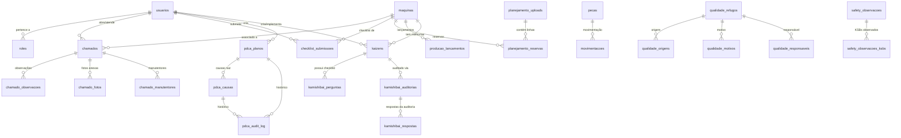

# Schema do Banco de Dados

> **Engine**: PostgreSQL (hospedado no Supabase)  
> **Armazenamento de timestamps**: UTC (`TIMESTAMPTZ DEFAULT timezone('utc', now())`)  
> **Display no frontend**: `America/Sao_Paulo` — via `apps/web/src/shared/utils/dateUtils.ts`

---

## 1. Diagrama Entidade-Relacionamento

---

## 2. Tabelas Principais

### Core (Autenticação e Autorização)

#### `usuarios`
Usuários do sistema com credenciais e papel.

| Coluna | Tipo | Descrição |
|--------|------|-----------|
| `id` | UUID | PK |
| `nome` | VARCHAR | Nome completo |
| `email` | VARCHAR | Email real do usuário (opcional, único) |
| `usuario` | VARCHAR | Username alternativo |
| `senha_hash` | VARCHAR | Hash da senha (bcrypt) |
| `matricula` | VARCHAR | Matrícula funcional |
| `role` | VARCHAR | Papel legado (ex: 'operador') |
| `role_id` | UUID | FK → roles.id |
| `funcao` | VARCHAR | Cargo/função |
| `created_at` | TIMESTAMP | Data de criação |

#### `roles`
Papéis com permissões granulares.

| Coluna | Tipo | Descrição |
|--------|------|-----------|
| `id` | UUID | PK |
| `nome` | VARCHAR | Nome do papel (ex: 'Gerente') |
| `descricao` | TEXT | Descrição |
| `permissoes` | JSONB | Mapa de permissões por pageKey |
| `is_system` | BOOLEAN | Se é role do sistema (não editável) |

---

### Manutenção

#### `maquinas`
Cadastro de máquinas/ativos.

| Coluna | Tipo | Descrição |
|--------|------|-----------|
| `id` | UUID | PK |
| `nome` | VARCHAR | Nome da máquina |
| `codigo` | VARCHAR | Código identificador |
| `parent_id` | UUID | FK → maquinas.id (hierarquia) |
| `escopo_producao` | BOOLEAN | Participa de produção |
| `escopo_planejamento` | BOOLEAN | Participa de planejamento |
| `aliases_producao` | TEXT[] | Aliases para match de produção |
| `aliases_planejamento` | TEXT[] | Aliases para match de planejamento |
| `capacidade_horas` | DECIMAL | Horas de capacidade |
| `setor_producao_id` | UUID | FK → producao_setores.id (agrupamento no painel de produção) |
| `ordem_producao` | INTEGER | Ordem de exibição da máquina no setor |

#### `chamados`
Sistema de chamados de manutenção.

| Coluna | Tipo | Descrição |
|--------|------|-----------|
| `id` | UUID | PK |
| `maquina_id` | UUID | FK → maquinas.id |
| `criado_por_id` | UUID | FK → usuarios.id (quem abriu) |
| `manutentor_id` | UUID | FK → usuarios.id (técnico principal; referência rápida para JOINs/filtros) |
| `status` | VARCHAR | `Aberto`, `Em Andamento`, `Concluido`, `Cancelado` |
| `tipo` | VARCHAR | `corretiva`, `preventiva` |
| `descricao` | TEXT | Descrição do problema |
| `causa` | TEXT | Causa raiz identificada |
| `solucao` | TEXT | Solução aplicada |
| `checklist` | JSONB | Itens de checklist preventivo |
| `agendamento_id` | UUID | FK → agendamentos_preventivos.id (se originado de agendamento) |
| `criado_em` | TIMESTAMPTZ | Quando foi aberto |
| `concluido_em` | TIMESTAMPTZ | Quando foi concluído |
| `concluido_por_id` | UUID | FK → usuarios.id |
| `concluido_por_email` | TEXT | Email de quem concluiu |
| `concluido_por_nome` | TEXT | Nome de quem concluiu |
| `atualizado_em` | TIMESTAMPTZ | Última atualização |

> **Nota:** A lista completa de participantes (principal + co-manutentores) está em `chamado_manutentores`.

#### `chamado_observacoes`
Histórico de observações/comentários em chamados.

| Coluna | Tipo | Descrição |
|--------|------|-----------|
| `id` | UUID | PK |
| `chamado_id` | UUID | FK → chamados.id |
| `usuario_email` | VARCHAR | Autor |
| `texto` | TEXT | Comentário |
| `created_at` | TIMESTAMP | Data |

#### `chamado_fotos`
Fotos anexadas a chamados.

| Coluna | Tipo | Descrição |
|--------|------|-----------|
| `id` | UUID | PK |
| `chamado_id` | UUID | FK → chamados.id |
| `storage_path` | VARCHAR | Caminho no storage |

#### `chamado_manutentores`
Lista de todos os manutentores que participaram de um chamado (co-manutenção). **Fonte canônica** da equipe de manutenção por chamado.

| Coluna | Tipo | Descrição |
|--------|------|-----------|
| `id` | UUID | PK |
| `chamado_id` | UUID | FK → chamados.id (CASCADE) |
| `manutentor_id` | UUID | ID do usuário |
| `manutentor_email` | TEXT | E-mail |
| `manutentor_nome` | TEXT | Nome |
| `papel` | TEXT | `'principal'` (quem atendeu) ou `'co'` (co-manutentor) |
| `entrou_em` | TIMESTAMPTZ | Data de entrada |

#### `checklist_submissoes`
Submissões de checklists diários.

| Coluna | Tipo | Descrição |
|--------|------|-----------|
| `id` | UUID | PK |
| `maquina_id` | UUID | FK → maquinas.id |
| `operador_id` | UUID | FK → usuarios.id |
| `turno` | VARCHAR | 1º, 2º, 3º |
| `respostas` | JSONB | Respostas do checklist |
| `created_at` | TIMESTAMP | Data/hora da submissão |

#### `checklist_pendencias`
Controle de checklists não realizados e suas justificativas.

| Coluna | Tipo | Descrição |
|--------|------|-----------|
| `id` | UUID | PK |
| `maquina_id` | UUID | FK → maquinas.id |
| `data_ref` | DATE | Data do checklist pendente |
| `turno` | VARCHAR | 1º, 2º |
| `status` | VARCHAR | PENDENTE, JUSTIFICADO |
| `justificativa` | TEXT | Motivo da não realização |
| `justificado_por_id` | UUID | FK → usuarios.id |
| `justificado_em` | TIMESTAMPTZ | Quando foi justificado |
| `created_at` | TIMESTAMPTZ | Data de criação |

#### `pecas`
Cadastro de peças de reposição.

| Coluna | Tipo | Descrição |
|--------|------|-----------|
| `id` | UUID | PK |
| `codigo` | VARCHAR | Código da peça |
| `nome` | VARCHAR | Nome |
| `categoria` | VARCHAR | Categoria |
| `estoque_atual` | INTEGER | Quantidade atual |
| `estoque_minimo` | INTEGER | Ponto de reposição |
| `localizacao` | VARCHAR | Local no almoxarifado |

#### `movimentacoes`
Histórico de movimentações de peças.

| Coluna | Tipo | Descrição |
|--------|------|-----------|
| `id` | UUID | PK |
| `peca_id` | UUID | FK → pecas.id |
| `tipo` | VARCHAR | entrada, saida |
| `quantidade` | INTEGER | Quantidade movimentada |
| `descricao` | TEXT | Motivo |
| `usuario_email` | VARCHAR | Quem movimentou |

#### `agendamentos_preventivos`
Agendamento de manutenções preventivas.

| Coluna | Tipo | Descrição |
|--------|------|-----------|
| `id` | UUID | PK |
| `maquina_id` | UUID | FK → maquinas.id |
| `frequencia` | VARCHAR | Diária, Semanal, Mensal |
| `proxima_data` | DATE | Próxima execução |

---

### Produção

#### `producao_lancamentos`
Lançamentos diários de produção.

| Coluna | Tipo | Descrição |
|--------|------|-----------|
| `id` | UUID | PK |
| `maquina_id` | UUID | FK → maquinas.id |
| `data` | DATE | Data |
| `horas_produzidas` | DECIMAL | Horas |
| `motivo_parada` | TEXT | Descrição de paradas |

#### `producao_setores`
Setores ou áreas lógicas do chão de fábrica.

| Coluna | Tipo | Descrição |
|--------|------|-----------|
| `id` | UUID | PK |
| `nome` | VARCHAR | Nome do setor (ex: "Usinagem Pesada") |
| `ordem` | INTEGER | Ordem de exibição do setor |

#### `producao_metas_padrao`
Meta mensal padrão para uma máquina.

| Coluna | Tipo | Descrição |
|--------|------|-----------|
| `id` | UUID | PK |
| `maquina_id` | UUID | FK → maquinas.id |
| `meta_diaria_horas` | DECIMAL | Target default diário (em horas) |
| `created_at` | TIMESTAMPTZ | Data de criação |

#### `producao_metas_dia`
Overrides de meta ou bloqueios (dia não útil) para datas específicas.

| Coluna | Tipo | Descrição |
|--------|------|-----------|
| `id` | UUID | PK |
| `maquina_id` | UUID | FK → maquinas.id |
| `data` | DATE | Data específica |
| `is_dia_util` | BOOLEAN | Se não útil, o dia deve ser ignorado para métricas gerais |
| `meta_diaria_horas` | DECIMAL | Meta específica se diferente do padrão (opcional) |
| `motivo_bloqueio` | TEXT | Motivo se dia não for útil |
| `created_at` | TIMESTAMPTZ | Data de criação |

#### `producao_upload_historico`
Histórico de uploads de produção.

| Coluna | Tipo | Descrição |
|--------|------|-----------|
| `id` | UUID | PK |
| `nome_arquivo` | VARCHAR | Nome do arquivo |
| `upload_por_email` | VARCHAR | Quem fez upload |
| `created_at` | TIMESTAMP | Data |

#### `producao_uploads`
Metadados dos uploads de produção (controle de versão).

| Coluna | Tipo | Descrição |
|--------|------|-----------|
| `id` | UUID | PK |
| `nome_arquivo` | VARCHAR | Nome do arquivo |
| `upload_por_id` | UUID | FK → usuarios.id |
| `upload_por_email` | VARCHAR | Email de quem fez |
| `company_id` | UUID | Empresa |
| `linhas_total` | INTEGER | Total de linhas |
| `linhas_sucesso` | INTEGER | Processadas com sucesso |
| `linhas_erro` | INTEGER | Com erro |
| `created_at` | TIMESTAMP | Data |

#### `producao_colaborador_metas`
Metas de eficiência por colaborador.

| Coluna | Tipo | Descrição |
|--------|------|-----------|
| `id` | UUID | PK |
| `matricula` | VARCHAR | Matrícula do colaborador |
| `nome` | VARCHAR | Nome do colaborador |
| `area` | VARCHAR | Área (usinagem, montagem, etc.) |
| `maquinas` | TEXT[] | Máquinas vinculadas |
| `meta_eficiencia` | DECIMAL | Meta de eficiência (%) |

---

### Planejamento

#### `planejamento_uploads`
Metadados de uploads de planilhas de capacidade.

| Coluna | Tipo | Descrição |
|--------|------|-----------|
| `id` | UUID | PK |
| `nome_arquivo` | VARCHAR | Nome do arquivo |
| `linhas_total` | INTEGER | Total de linhas |
| `linhas_sucesso` | INTEGER | Processadas com sucesso |
| `linhas_erro` | INTEGER | Com erro |
| `ativo` | BOOLEAN | Se está ativo |
| `upload_por_email` | VARCHAR | Autor |
| `criado_em` | TIMESTAMP | Data |

#### `planejamento_reservas`
Linhas de reserva processadas do Excel.

| Coluna | Tipo | Descrição |
|--------|------|-----------|
| `id` | UUID | PK |
| `upload_id` | UUID | FK → planejamento_uploads.id |
| `maquina_id` | UUID | FK → maquinas.id |
| `centro_trabalho_original` | VARCHAR | Nome do Excel |
| `numero_item` | VARCHAR | Número do item |
| `horas` | DECIMAL | Horas reservadas |
| `status` | VARCHAR | Criado, Liberado, Iniciado |
| `data_programada` | VARCHAR | Data planejada |

---

### Qualidade

#### `qualidade_refugos`
Registros de não-conformidades e refugos.

| Coluna | Tipo | Descrição |
|--------|------|-----------|
| `id` | UUID | PK |
| `data_ocorrencia` | DATE | Data do refugo |
| `origem_referencia` | VARCHAR | Referência (ex: OP ou NF) |
| `codigo_item` | VARCHAR | Código do item |
| `descricao_item` | TEXT | Descrição do item |
| `motivo_defeito` | TEXT | Motivo da rejeição |
| `quantidade` | DECIMAL | Quantidade refugada |
| `custo` | DECIMAL | Custo total do refugo |
| `setor` | VARCHAR | Setor responsável |
| `responsavel_nome` | VARCHAR | Nome do responsável (texto) |
| `numero_ncr` | VARCHAR | Número da NCR |
| `tipo_lancamento` | TEXT | `"REFUGO"` ou `"QUARENTENA"` |
| `criado_por_id` | UUID | FK → usuarios.id |
| `created_at` | TIMESTAMP | Data de lançamento |

**Indexes em `qualidade_refugos`** (criados em março/2026):

| Index | Colunas | Tipo | Uso |
|-------|---------|------|-----|
| `idx_qualidade_refugos_data` | `data_ocorrencia` | B-tree | Filtro e ordenação por data (pré-existente) |
| `idx_qualidade_refugos_setor` | `origem` | B-tree | Filtro por origem/setor (pré-existente) |
| `idx_qualidade_refugos_codigo_item` | `codigo_item` | B-tree | Busca por código (pré-existente) |
| `idx_qualidade_refugos_responsavel` | `responsavel_nome` | B-tree | Filtro e agrupamento por responsável |
| `idx_qualidade_refugos_tipo_lancamento` | `tipo_lancamento` | B-tree | Filtro REFUGO/QUARENTENA |
| `idx_qualidade_refugos_data_responsavel` | `(data_ocorrencia DESC, responsavel_nome)` | B-tree | Analytics por responsável no período |
| `idx_qualidade_refugos_data_origem` | `(data_ocorrencia DESC, origem)` | B-tree | Analytics por origem no período |

#### `qualidade_origens`
Cadastro de origens (setores/áreas).

| Coluna | Tipo | Descrição |
|--------|------|-----------|
| `id` | UUID | PK |
| `nome` | VARCHAR | Nome da origem |
| `ativo` | BOOLEAN | Se está ativa |
| `created_at` | TIMESTAMP | Data de criação |

#### `qualidade_motivos`
Cadastro de motivos de defeito.

| Coluna | Tipo | Descrição |
|--------|------|-----------|
| `id` | UUID | PK |
| `nome` | VARCHAR | Nome do motivo |
| `ativo` | BOOLEAN | Se está ativo |
| `created_at` | TIMESTAMP | Data de criação |

#### `qualidade_responsaveis`
Cadastro de responsáveis por origem.

| Coluna | Tipo | Descrição |
|--------|------|-----------|
| `id` | UUID | PK |
| `nome` | VARCHAR | Nome do responsável |
| `origem_id` | UUID | FK → qualidade_origens.id |
| `ativo` | BOOLEAN | Se está ativo |

---

### Logística

#### `logistica_metas`
Metas mensais do departamento.

| Coluna | Tipo | Descrição |
|--------|------|-----------|
| `id` | UUID | PK |
| `mes` | INTEGER | Mês (1-12) |
| `ano` | INTEGER | Ano |
| `meta_financeira` | DECIMAL | Meta de faturamento total |
| `updated_at` | TIMESTAMP | Última atualização |

#### `logistica_kpis_diario`
Apontamentos diários de logística.

| Coluna | Tipo | Descrição |
|--------|------|-----------|
| `id` | UUID | PK |
| `data` | DATE | Data do apontamento (Unique) |
| `faturado_acumulado` | DECIMAL | Valor acumulado de faturamento |
| `exportacao_acumulado` | DECIMAL | Valor acumulado de exportação |
| `devolucoes_dia` | DECIMAL | Valor de devoluções do dia |
| `total_linhas` | INTEGER | Total de linhas expedidas |
| `linhas_atraso` | INTEGER | Linhas em atraso |
| `backlog_atraso` | INTEGER | Backlog acumulado em atraso |
| `ottr_ytd` | DECIMAL | Percentual OTTR acumulado (0-100) |
| `is_dia_util` | BOOLEAN | (Default true) Se conta para meta |
| `updated_at` | TIMESTAMP | Última atualização |

#### `logistica_proposto_uploads`
Controle de uploads do relatório HTML de faturamento proposto.

| Coluna | Tipo | Descrição |
|--------|------|-----------|
| `id` | UUID | PK |
| `nome_arquivo` | VARCHAR | Nome do arquivo enviado |
| `linhas_total` | INTEGER | Quantidade total de linhas recebidas |
| `upload_por_email` | VARCHAR | Email do usuário que fez upload |
| `ativo` | BOOLEAN | Marca o upload atualmente ativo |
| `criado_em` | TIMESTAMPTZ | Data/hora de criação do upload |

#### `logistica_proposto_dados`
Linhas detalhadas extraídas do relatório HTML "Faturamento Proposto".

| Coluna | Tipo | Descrição |
|--------|------|-----------|
| `id` | UUID | PK |
| `upload_id` | UUID | FK → logistica_proposto_uploads.id |
| `canal_vendas` | INTEGER | Código do canal de vendas |
| `canal_descricao` | TEXT | Descrição do canal de vendas |
| `roteiro_separacao` | VARCHAR | Código do roteiro de separação |
| `data_hora` | TIMESTAMPTZ | Data/hora do registro no relatório |
| `ordem_venda` | VARCHAR | Código da ordem de venda (OV) |
| `conta_cliente` | VARCHAR | Código da conta do cliente |
| `nome_cliente` | TEXT | Nome do cliente |
| `numero_item` | VARCHAR | Número do item |
| `configuracao` | VARCHAR | Configuração do item |
| `filial` | TEXT | Filial associada |
| `tipo_destino` | VARCHAR | Tipo de destino/logística |
| `localizacao` | VARCHAR | Localização do item |
| `valor_net` | DECIMAL(15,2) | Valor NET da linha |
| `cidade` | VARCHAR | Cidade de destino |
| `estado` | VARCHAR(10) | Estado (UF) |

---

### PDCA

#### `pdca_planos`
Planos de ação principal.

| Coluna | Tipo | Descrição |
|--------|------|-----------|
| `id` | UUID | PK |
| `numero` | SERIAL | Número sequencial |
| `titulo` | VARCHAR(500) | Título do plano |
| `origem` | TEXT | Texto livre (Auditoria Interna, etc.) |
| `tipo` | TEXT | Tipo (NC, OM, OBS, etc.) |
| `nao_conformidade` | TEXT | Descrição do problema |
| `status` | VARCHAR(50) | `aberto`, `em_andamento`, `concluido` |
| `company_id` | UUID | Multi-tenancy: empresa |
| `criado_por_id` | UUID | FK → usuarios.id |
| `created_at` | TIMESTAMPTZ | Data de criação |
| `updated_at` | TIMESTAMPTZ | Última atualização |

#### `pdca_causas`
Causas raiz (múltiplas por plano).

| Coluna | Tipo | Descrição |
|--------|------|-----------|
| `id` | UUID | PK |
| `plano_id` | UUID | FK → pdca_planos.id (CASCADE) |
| `causa_raiz` | TEXT | Descrição da causa raiz |
| `correcao` | TEXT | Correção imediata |
| `acao_corretiva` | TEXT | Ação para evitar recorrência |
| `responsavel` | VARCHAR(255) | Responsável |
| `data_planejada` | DATE | Data planejada |
| `data_realizada` | DATE | Data real |
| `verificacao_data_planejada` | DATE | Verificação planejada |
| `verificacao_data_realizada` | DATE | Verificação real |
| `eficaz` | BOOLEAN | Declarativo |
| `verificacao_eficacia` | TEXT | Descrição da verificação |
| `created_at` | TIMESTAMPTZ | Data de criação |
| `updated_at` | TIMESTAMPTZ | Última atualização |

#### `pdca_audit_log`
Histórico de alterações.

| Coluna | Tipo | Descrição |
|--------|------|-----------|
| `id` | UUID | PK |
| `entidade` | VARCHAR(50) | `plano` ou `causa` |
| `entidade_id` | UUID | ID da entidade |
| `acao` | VARCHAR(50) | `criado`, `atualizado`, `excluido` |
| `dados_anteriores` | JSONB | Snapshot anterior |
| `dados_novos` | JSONB | Snapshot novo |
| `usuario_id` | UUID | FK → usuarios.id |
| `usuario_email` | VARCHAR(255) | Email |
| `created_at` | TIMESTAMPTZ | Data |

---

### Melhoria Contínua (Kaizen / Kamishibai)

#### `kaizens`
Registro de painéis de melhoria contínua e status atual.

| Coluna | Tipo | Descrição |
|--------|------|-----------|
| `id` | UUID | PK |
| `titulo` | VARCHAR | Título do Kaizen |
| `maquina_id` | UUID | FK → maquinas.id |
| `status` | VARCHAR | planejado, em_andamento, concluido, padronizado |
| `problema_antes` | TEXT | Descrição do estado anterior |
| `solucao_depois` | TEXT | Descrição da solução |
| `ganhos` | TEXT | Impacto gerado |
| `data_implementacao` | DATE | Data de término da implementação |
| `thumbnail_url` | VARCHAR | URL da imagem do Kaizen |
| `criado_por` | UUID | FK → usuarios.id |
| `criado_em` | TIMESTAMPTZ | Data de criação |

#### `kamishibai_perguntas`
Checklist dinâmico de sustentação do padrão para cada Kaizen.

| Coluna | Tipo | Descrição |
|--------|------|-----------|
| `id` | UUID | PK |
| `kaizen_id` | UUID | FK → kaizens.id |
| `texto_pergunta` | TEXT | A pergunta da auditoria |
| `ordem` | INTEGER | Posição no formulário |
| `ativo` | BOOLEAN | Se a pergunta ainda é avaliada |

#### `kamishibai_auditorias`
Cabeçalho de cada ciclo de auditoria visual de um Kaizen.

| Coluna | Tipo | Descrição |
|--------|------|-----------|
| `id` | UUID | PK |
| `kaizen_id` | UUID | FK → kaizens.id |
| `auditor_id` | UUID | FK → usuarios.id |
| `data_auditoria` | TIMESTAMPTZ | Quando ocorreu |
| `status` | VARCHAR | conforme, nao_conforme |
| `observacoes` | TEXT | Notas gerais |

#### `kamishibai_respostas`
Respostas granulares da auditoria.

| Coluna | Tipo | Descrição |
|--------|------|-----------|
| `id` | UUID | PK |
| `auditoria_id` | UUID | FK → kamishibai_auditorias.id |
| `pergunta_id` | UUID | FK → kamishibai_perguntas.id |
| `is_conforme` | BOOLEAN | Ok / Nok |
| `observacao` | TEXT | Comentário individual do item |

---

### Core (Adicional)

#### `notificacoes_config`
Configuração de destinatários de notificações por email.

| Coluna | Tipo | Descrição |
|--------|------|-----------|
| `id` | UUID | PK |
| `evento` | VARCHAR | Evento de notificação (ex.: `NOVO_CHAMADO`) |
| `usuario_id` | UUID | FK para `usuarios.id` |
| `created_at` | TIMESTAMP | Data de criação |

#### `notificacoes_enviadas`
Controle de idempotência para evitar reenvio duplicado de notificações automáticas.

| Coluna | Tipo | Descrição |
|--------|------|-----------|
| `id` | UUID | PK |
| `evento` | VARCHAR | Evento enviado (ex.: `PREVENTIVA_D1`, `PREVENTIVA_D0`) |
| `agendamento_id` | UUID | FK para `agendamentos_preventivos.id` |
| `usuario_id` | UUID | FK para `usuarios.id` |
| `data_ref_local` | DATE | Data de referência local (America/Sao_Paulo) |
| `enviado_em` | TIMESTAMP WITH TIME ZONE | Timestamp de envio |

---

### Views

| View | Descrição |
|------|-----------|
| `v_producao_rendimento` | Rendimento de produção calculado (usado em `routes/producao/lancamentos.ts`) |

### Safety (BBS)

#### `safety_observacoes`
Armazena observações comportamentais (BBS) importadas da plataforma externa. Cada registro é deduplicado por `registro_id`.

| Coluna | Tipo | Descrição |
|--------|------|-----------|
| `id` | UUID (PK) | Identificador único |
| `registro_id` | INTEGER (UNIQUE) | ID de registro na plataforma externa |
| `data_observacao` | DATE | Data da observação |
| `observador` | TEXT | Nome do observador |
| `num_pessoas_observadas` | INTEGER | Número de pessoas observadas |
| `descricao` | TEXT | Descrição da observação |
| `departamento_reporter` | TEXT | Departamento do observador |
| `localizacao` | TEXT | Localização da observação |
| `tipo_observador` | TEXT | Tipo do observador (interno/externo) |
| `causa_comportamento` | TEXT | Causa do comportamento (Erro, Violação, Comportamento seguro) |
| `tipo_comportamento` | TEXT | Tipo do comportamento |
| `feedback_dado` | BOOLEAN | Se feedback foi dado ao observado |
| `stop_work_authority` | BOOLEAN | Se SWA foi exercido |
| `resultado_conversa` | TEXT | Resultado da conversa |
| `data_fechamento` | TIMESTAMPTZ | Data de fechamento do registro |
| `registro_fechado` | BOOLEAN | Se o registro está fechado |
| `fatores_contribuintes` | TEXT | Fatores contribuintes |
| `qual_causa` | TEXT | Qual causa específica |
| `modelo` | TEXT | Modelo do formulário (BBS PAD, Bloco escritório BBS) |
| `criado_em` / `atualizado_em` | TIMESTAMPTZ | Timestamps automáticos |

#### `safety_observacoes_ksbs`
Relação N:N entre observações e categorias KSBs (Key Safety Behaviors). Uma observação pode ter múltiplos KSBs, cada um com resposta "Seguros" ou "Arriscados".

| Coluna | Tipo | Descrição |
|--------|------|-----------|
| `id` | UUID (PK) | Identificador único |
| `observacao_id` | UUID (FK → safety_observacoes) | Referência à observação |
| `categoria` | TEXT | Categoria KSB (EPI, Movendo-se em torno, etc.) |
| `resposta` | TEXT | Classificação: "Arriscados" ou "Seguros" |

#### `safety_uploads`
Histórico de uploads de relatórios CSV/XLSX de Safety.

| Coluna | Tipo | Descrição |
|--------|------|-----------|
| `id` | UUID (PK) | Identificador único |
| `nome_arquivo` | TEXT | Nome do arquivo enviado |
| `total_linhas` | INTEGER | Total de linhas no arquivo |
| `registros_novos` | INTEGER | Quantidade de registros criados |
| `registros_atualizados` | INTEGER | Quantidade de registros atualizados |
| `enviado_por` | UUID (FK → usuarios) | Usuário que fez o upload |
| `criado_em` | TIMESTAMPTZ | Data do upload |

---

## 3. Convenções

| Padrão | Descrição |
|--------|-----------|
| **PKs** | Sempre `id` do tipo `UUID` com `gen_random_uuid()` |
| **FKs** | Nomenclatura `{tabela}_id` |
| **Timestamps** | `created_at`, `updated_at` (TIMESTAMP WITH TIME ZONE) |
| **Soft Delete** | Preferir flag `ativo` quando necessário |
| **JSONB** | Para estruturas flexíveis (respostas, permissões) |

---

## Links Relacionados

- [Arquitetura do Sistema](ARCHITECTURE.md)
- [Sistema de Permissões](PERMISSIONS.md)
