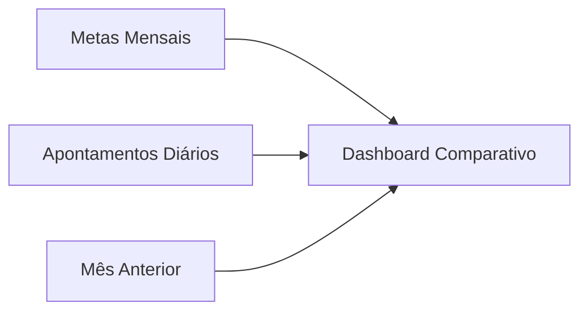

# Módulo Logística

> Documentação do módulo de Logística da plataforma TPM.

## Visão Geral

O módulo de Logística gerencia indicadores operacionais do departamento, incluindo faturamento acumulado, exportações, devoluções, atrasos de linhas e OTTR (On-Time To Request). Os dados são organizados por dia e comparados com metas mensais.

---

## Rotas API

**Arquivo**: `apps/api/src/routes/logistica/kpis.ts`

### KPIs Diários

| Método | Rota | Permissão | Descrição |
|--------|------|-----------|-----------|
| GET | `/logistica/kpis` | `logistica_dashboard` (ver) | Dados mensais: meta + KPIs diários + mês anterior |
| PUT | `/logistica/kpis/:data` | `logistica_kpis` (editar) | Upsert de apontamento diário (YYYY-MM-DD) |

### Metas

| Método | Rota | Permissão | Descrição |
|--------|------|-----------|-----------|
| PUT | `/logistica/metas/:mes/:ano` | `logistica_kpis` (editar) | Upsert de meta mensal |

---

## Páginas Frontend

**Pasta**: `apps/web/src/features/logistica/pages/`

| Página | Arquivo | Descrição |
|--------|---------|-----------|
| **Dashboard** | `LogisticaDashboardPage.tsx` | Dashboard com grid de KPIs diários, metas, e comparativo |

---

## Permissões

| PageKey | Descrição | Níveis |
|---------|-----------|--------|
| `logistica_dashboard` | Dashboard de logística | `ver` |
| `logistica_kpis` | Gerenciamento de indicadores/metas | `ver`, `editar` |

---

## Entidades de Dados

### `logistica_metas`
Metas mensais do departamento.

| Coluna | Tipo | Descrição |
|--------|------|-----------|
| `id` | UUID | PK |
| `mes` | INTEGER | Mês (1-12) |
| `ano` | INTEGER | Ano |
| `meta_financeira` | DECIMAL | Meta de faturamento total |
| `updated_at` | TIMESTAMP | Última atualização |

### `logistica_kpis_diario`
Apontamentos diários de logística.

| Coluna | Tipo | Descrição |
|--------|------|-----------|
| `id` | UUID | PK |
| `data` | DATE | Data do apontamento (Unique) |
| `faturado_acumulado` | DECIMAL | Valor acumulado de faturamento |
| `exportacao_acumulado` | DECIMAL | Valor acumulado de exportação |
| `devolucoes_dia` | DECIMAL | Valor de devoluções do dia |
| `total_linhas` | INTEGER | Total de linhas expedidas |
| `linhas_atraso` | INTEGER | Linhas em atraso |
| `backlog_atraso` | INTEGER | Backlog acumulado em atraso |
| `ottr_ytd` | DECIMAL | Percentual OTTR acumulado (0-100) |
| `is_dia_util` | BOOLEAN | (Default true) Se conta para meta |
| `updated_at` | TIMESTAMP | Última atualização |

---

## Regras de Negócio

1. **Upsert**: Tanto KPIs diários quanto metas mensais usam lógica de upsert (insert ou update).
2. **Comparativo**: GET retorna dados do mês atual + mês anterior para comparação.
3. **COALESCE**: Updates parciais preservam valores existentes via `COALESCE`.
4. **Transações**: Upsert de KPIs diários usa transação (BEGIN/COMMIT/ROLLBACK).

---

## Links Relacionados

- [Schema](../DATABASE.md) - Tabelas `logistica_metas`, `logistica_kpis_diario`, `logistica_notas_embarque`, `logistica_proposto_uploads`, `logistica_proposto_dados`
- [Permissões](../PERMISSIONS.md) - `logistica_dashboard`, `logistica_kpis`, `logistica_painel`, `logistica_proposto`

---

## Painel Logístico (Notas de Embarque)

Painel de gestão de notas fiscais de embarque com foco em análise de atrasos. Dados importados via upload de CSV (`;`-delimited).

### Rotas API (Painel)

**Arquivo**: `apps/api/src/routes/logistica/painel.ts`

| Método | Rota | Permissão | Descrição |
|--------|------|-----------|-----------|
| POST | `/logistica/notas-embarque/upload` | `logistica_painel` (editar) | Upload CSV (JSON parseado pelo frontend) |
| GET | `/logistica/notas-embarque` | `logistica_painel` (ver) | Lista notas do último upload |
| DELETE | `/logistica/notas-embarque/:uploadId` | `logistica_painel` (editar) | Remove upload e notas |

### Páginas Frontend (Painel)

| Página | Arquivo | Rota | Permissão |
|--------|---------|------|-----------|
| **Painel Logístico** | `PainelLogisticoPage.tsx` | `/logistica/painel` | `logistica_painel` (ver) |
| **Upload Notas** | `PainelUploadPage.tsx` | `/logistica/painel/upload` | `logistica_painel` (editar) |

### Permissão

| PageKey | Descrição | Níveis |
|---------|-----------|--------|
| `logistica_painel` | Painel de notas de embarque | `ver`, `editar` |

### Entidade: `logistica_notas_embarque`

| Coluna | Tipo | Descrição |
|--------|------|-----------|
| `id` | UUID | PK |
| `upload_id` | UUID | Agrupa linhas de um mesmo upload |
| `ordem_venda` | TEXT | Código da OV |
| `nome_cliente` | TEXT | Nome do cliente |
| `transportadora` | TEXT | Transportadora |
| `nota_fiscal` | TEXT | Número da NF |
| `valor_net` | DECIMAL(15,2) | Valor NET |
| `peso_bruto` | DECIMAL(12,2) | Peso bruto (kg) |
| `qtd_volume` | INTEGER | Quantidade de volumes |
| `data_emissao` | DATE | Data de emissão |
| `tipo_operacao` | TEXT | Tipo de operação de venda |
| `condicoes_entrega` | TEXT | Condições de entrega |
| `tipo_frete` | TEXT | Tipo de frete |
| `valor_moeda` | DECIMAL(15,2) | Valor na moeda |
| `dias_atraso` | INTEGER | Dias em atraso |
| `uploaded_at` | TIMESTAMPTZ | Data/hora do upload |
| `uploaded_by` | UUID | FK → usuarios.id |

---

## Painel Logístico (Faturamento Proposto HTML)

Painel para leitura e análise do relatório HTML "Faturamento Proposto", exportado do Dynamics. O frontend extrai as linhas relevantes do documento (`.htm/.html`) e envia JSON parseado para persistência.

### Rotas API (Painel Proposto)

**Arquivo**: `apps/api/src/routes/logistica/proposto.ts`

| Método | Rota | Permissão | Descrição |
|--------|------|-----------|-----------|
| POST | `/logistica/proposto/upload` | `logistica_proposto` (editar) | Upload do relatório HTML parseado no frontend |
| GET | `/logistica/proposto` | `logistica_proposto` (ver) | Lista linhas do último upload ativo |
| DELETE | `/logistica/proposto/:uploadId` | `logistica_proposto` (editar) | Remove upload e linhas associadas |

### Páginas Frontend (Painel Proposto)

| Página | Arquivo | Rota | Permissão |
|--------|---------|------|-----------|
| **Dashboard Proposto** | `LogisticaPropostoDashboardPage.tsx` | `/logistica/proposto/dashboard` | `logistica_proposto` (ver) |
| **Upload Proposto** | `LogisticaPropostoUploadPage.tsx` | `/logistica/proposto/upload` | `logistica_proposto` (editar) |

### Permissão

| PageKey | Descrição | Níveis |
|---------|-----------|--------|
| `logistica_proposto` | Painel de faturamento proposto (HTML) | `ver`, `editar` |

### Entidades: `logistica_proposto_uploads` e `logistica_proposto_dados`

- `logistica_proposto_uploads`: controla o último arquivo ativo por contexto do painel.
- `logistica_proposto_dados`: armazena linhas detalhadas (canal, OV, cliente, valor NET, cidade/UF, etc.) para dashboard e filtros.
