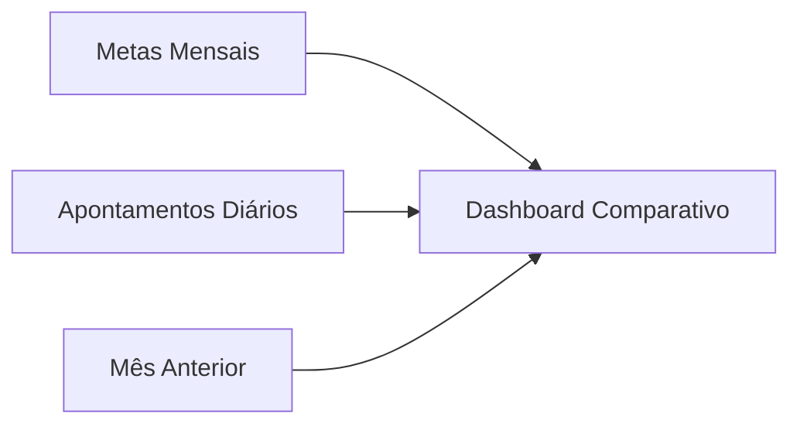

# Módulo Logística

> Documentação do módulo de Logística da plataforma TPM.

## Visão Geral

O módulo de Logística gerencia indicadores operacionais do departamento, incluindo faturamento acumulado, exportações, devoluções, atrasos de linhas e OTTR (On-Time To Request). Os dados são organizados por dia e comparados com metas mensais.

---

## Rotas API

**Arquivo**: `apps/api/src/routes/logistica/kpis.ts`

### KPIs Diários

| Método | Rota | Permissão | Descrição |
|--------|------|-----------|-----------|
| GET | `/logistica/kpis` | `logistica_dashboard` (ver) | Dados mensais: meta + KPIs diários + mês anterior |
| PUT | `/logistica/kpis/:data` | `logistica_kpis` (editar) | Upsert de apontamento diário (YYYY-MM-DD) |

### Metas

| Método | Rota | Permissão | Descrição |
|--------|------|-----------|-----------|
| PUT | `/logistica/metas/:mes/:ano` | `logistica_kpis` (editar) | Upsert de meta mensal |

---

## Páginas Frontend

**Pasta**: `apps/web/src/features/logistica/pages/`

| Página | Arquivo | Descrição |
|--------|---------|-----------|
| **Dashboard** | `LogisticaDashboardPage.tsx` | Dashboard com grid de KPIs diários, metas, e comparativo |

---

## Permissões

| PageKey | Descrição | Níveis |
|---------|-----------|--------|
| `logistica_dashboard` | Dashboard de logística | `ver` |
| `logistica_kpis` | Gerenciamento de indicadores/metas | `ver`, `editar` |

---

## Entidades de Dados

### `logistica_metas`
Metas mensais do departamento.

| Coluna | Tipo | Descrição |
|--------|------|-----------|
| `id` | UUID | PK |
| `mes` | INTEGER | Mês (1-12) |
| `ano` | INTEGER | Ano |
| `meta_financeira` | DECIMAL | Meta de faturamento total |
| `updated_at` | TIMESTAMP | Última atualização |

### `logistica_kpis_diario`
Apontamentos diários de logística.

| Coluna | Tipo | Descrição |
|--------|------|-----------|
| `id` | UUID | PK |
| `data` | DATE | Data do apontamento (Unique) |
| `faturado_acumulado` | DECIMAL | Valor acumulado de faturamento |
| `exportacao_acumulado` | DECIMAL | Valor acumulado de exportação |
| `devolucoes_dia` | DECIMAL | Valor de devoluções do dia |
| `total_linhas` | INTEGER | Total de linhas expedidas |
| `linhas_atraso` | INTEGER | Linhas em atraso |
| `backlog_atraso` | INTEGER | Backlog acumulado em atraso |
| `ottr_ytd` | DECIMAL | Percentual OTTR acumulado (0-100) |
| `is_dia_util` | BOOLEAN | (Default true) Se conta para meta |
| `updated_at` | TIMESTAMP | Última atualização |

---

## Regras de Negócio

1. **Upsert**: Tanto KPIs diários quanto metas mensais usam lógica de upsert (insert ou update).
2. **Comparativo**: GET retorna dados do mês atual + mês anterior para comparação.
3. **COALESCE**: Updates parciais preservam valores existentes via `COALESCE`.
4. **Transações**: Upsert de KPIs diários usa transação (BEGIN/COMMIT/ROLLBACK).

---

## Links Relacionados

- [Schema](../DATABASE.md) - Tabelas `logistica_metas`, `logistica_kpis_diario`
- [Permissões](../PERMISSIONS.md) - `logistica_dashboard`, `logistica_kpis`
