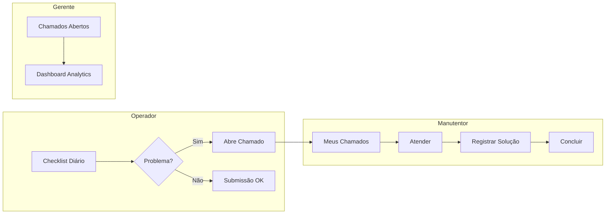
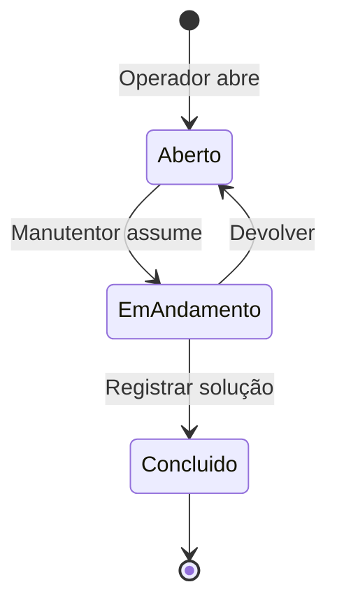

# Módulo de Manutenção

> **Responsável**: Gestão de chamados, checklists diários e peças de reposição.

---

## Visão Geral

O módulo de Manutenção é o core da plataforma TPM. Gerencia todo o ciclo de vida de chamados de manutenção, desde a abertura por operadores até a conclusão por técnicos.

---

## Rotas API

**Arquivo**: `apps/api/src/routes/manutencao/`

### Chamados (`chamados.ts`)

| Método | Rota | Permissão | Descrição |
|--------|------|-----------|-----------|
| GET | `/chamados` | - | Lista chamados com filtros e paginação |
| GET | `/chamados/:id` | - | Detalhe do chamado |
| POST | `/chamados` | `meus_chamados: editar` | Criar chamado |
| PATCH | `/chamados/:id/status` | `chamados_abertos: editar` | Alterar status |
| DELETE | `/chamados/:id` | `maquinas: editar` | Excluir chamado |
| POST | `/chamados/:id/observacoes` | `meus_chamados: editar` | Adicionar comentário |
| POST | `/chamados/:id/fotos` | `meus_chamados: editar` | Upload de fotos |
| GET | `/chamados/:id/fotos` | - | Listar fotos |

### Checklists (`checklists.ts`)

| Método | Rota | Descrição |
|--------|------|-----------|
| POST | `/checklists` | Submeter checklist de início de turno |
| GET | `/checklists/overview` | Visão geral de submissões |
| GET | `/checklists/maquina/:id` | Checklists por máquina |
| GET | `/checklists/pendencias` | `checklists_pendencias: ver` | Listar pendências |
| POST | `/checklists/pendencias/justificar` | `checklists_pendencias: editar` | Justificar pendência |
| GET | `/checklists/pendencias/historico` | `checklists_pendencias: ver` | Histórico de justificativas |

### Peças (`pecas.ts`)

| Método | Rota | Permissão | Descrição |
|--------|------|-----------|-----------|
| GET | `/pecas` | `pecas: ver` | Listar peças |
| POST | `/pecas` | `pecas: editar` | Cadastrar peça |
| DELETE | `/pecas/:id` | `pecas: editar` | Excluir peça |
| POST | `/movimentacoes` | `pecas: editar` | Registrar entrada/saída |

### Agendamentos (`agendamentos.ts`)

| Método | Rota | Descrição |
|--------|------|-----------|
| GET | `/agendamentos` | Listar agendamentos preventivos |
| POST | `/agendamentos` | Criar agendamento |

---

## Páginas Frontend

**Pasta**: `apps/web/src/features/manutencao/`

### Chamados (`chamados/pages/`)

| Página | Arquivo | Descrição |
|--------|---------|-----------|
| **Meus Chamados** | `MeusChamados.tsx` | Chamados do operador logado |
| **Chamados Abertos** | `ChamadosAbertosPage.tsx` | Visão gerencial de todos |
| **Detalhe** | `ChamadoDetalhe.tsx` | Visualização completa |
| **Histórico** | `HistoricoPage.tsx` | Chamados concluídos |
| **Abrir (Manutentor)** | `AbrirChamadoManutentor.tsx` | Formulário técnico |

### Checklists (`checklists/pages/`)

| Página | Arquivo | Descrição |
|--------|---------|-----------|
| **Início de Turno** | `InicioTurnoPage.tsx` | Wizard do operador |
| **Overview** | `ChecklistOverview.tsx` | Dashboard de submissões |
| **Justificativa** | `JustificativaChecklistPage.tsx` | Gerenciamento de pendências |

---

## Fluxo de Status (Chamados)

**Status disponíveis:**
- `Aberto` - Aguardando atendimento
- `Em Andamento` - Técnico trabalhando
- `Concluído` - Problema resolvido

---

## Regras de Negócio

1. **Checklist → Chamado automático**: Se operador marca item como NOK, sistema pode criar chamado automaticamente.
2. **Fotos obrigatórias**: Alguns tipos de chamado exigem foto antes de conclusão.
3. **Tempo de parada**: Calculado automaticamente (conclusão - abertura).
4. **Responsável atual**: Quando manutentor assume, vira responsável até devolver ou concluir.

---

## Links Relacionados

- [Arquitetura](../ARCHITECTURE.md)
- [Schema de Dados](../DATABASE.md) - Tabelas `chamados`, `checklist_submissoes`
- [Permissões](../PERMISSIONS.md) - `meus_chamados`, `chamados_abertos`
