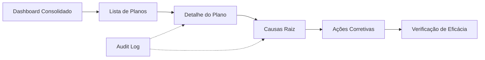

# Módulo PDCA

> Documentação do módulo de PDCA (Plan-Do-Check-Act) da plataforma TPM.

## Visão Geral

O módulo PDCA gerencia planos de ação para tratamento de não-conformidades, com rastreamento de causas raiz, ações corretivas e verificação de eficácia. Suporta multi-tenancy via `company_id`.

---

## Rotas API

**Pasta**: `apps/api/src/routes/pdca/`

### Dashboard (`dashboard.ts`)

| Método | Rota | Permissão | Descrição |
|--------|------|-----------|-----------|
| GET | `/pdca/dashboard` | `pdca_dashboard` (ver) | Dashboard consolidado com KPIs de produção, manutenção, qualidade, faturamento e PDCA |
| GET | `/pdca/audit/:entidade/:id` | `pdca_planos` (ver) | Histórico de alterações (audit log) |

### Planos (`planos.ts`)

| Método | Rota | Permissão | Descrição |
|--------|------|-----------|-----------|
| GET | `/pdca/planos` | `pdca_planos` (ver) | Listar planos com paginação e filtros (status, origem, data) |
| GET | `/pdca/planos/:id` | `pdca_planos` (ver) | Detalhe do plano com causas |
| POST | `/pdca/planos` | `pdca_planos` (editar) | Criar plano |
| PUT | `/pdca/planos/:id` | `pdca_planos` (editar) | Atualizar plano |
| DELETE | `/pdca/planos/:id` | `pdca_planos` (editar) | Excluir plano |

### Causas (`causas.ts`)

| Método | Rota | Permissão | Descrição |
|--------|------|-----------|-----------|
| POST | `/pdca/planos/:planoId/causas` | `pdca_planos` (editar) | Adicionar causa a um plano |
| PUT | `/pdca/causas/:id` | `pdca_planos` (editar) | Atualizar causa |
| DELETE | `/pdca/causas/:id` | `pdca_planos` (editar) | Excluir causa |

---

## Páginas Frontend

**Pasta**: `apps/web/src/features/pdca/pages/`

| Página | Arquivo | Descrição |
|--------|---------|-----------|
| **Dashboard** | `PdcaDashboardPage.tsx` | Dashboard consolidado com KPIs de todos os módulos |
| **Lista de Planos** | `PdcaPlanosPage.tsx` | Listagem de planos com filtros e paginação |
| **Detalhe do Plano** | `PdcaPlanoDetailPage.tsx` | Edição do plano, gestão de causas e ações |

---

## Permissões

| PageKey | Descrição | Níveis |
|---------|-----------|--------|
| `pdca_dashboard` | Dashboard consolidado do PDCA | `ver` |
| `pdca_planos` | Gestão de planos de ação e causas | `ver`, `editar` |

---

## Entidades de Dados

### `pdca_planos`
Planos de ação principal.

| Coluna | Tipo | Descrição |
|--------|------|-----------|
| `id` | UUID | PK |
| `numero` | SERIAL | Número sequencial |
| `titulo` | VARCHAR(500) | Título do plano |
| `origem` | TEXT | Texto livre (Auditoria Interna, etc.) |
| `tipo` | TEXT | Tipo (NC, OM, OBS, etc.) |
| `nao_conformidade` | TEXT | Descrição do problema |
| `status` | VARCHAR(50) | `aberto`, `em_andamento`, `concluido` |
| `company_id` | UUID | Multi-tenancy: UUID da empresa |
| `criado_por_id` | UUID | FK → usuarios.id |
| `created_at` | TIMESTAMPTZ | Data de criação |
| `updated_at` | TIMESTAMPTZ | Última atualização |

### `pdca_causas`
Causas raiz (múltiplas por plano).

| Coluna | Tipo | Descrição |
|--------|------|-----------|
| `id` | UUID | PK |
| `plano_id` | UUID | FK → pdca_planos.id (CASCADE) |
| `causa_raiz` | TEXT | Descrição da causa raiz |
| `correcao` | TEXT | Correção imediata |
| `acao_corretiva` | TEXT | Ação para evitar recorrência |
| `responsavel` | VARCHAR(255) | Responsável pela ação |
| `data_planejada` | DATE | Data planejada |
| `data_realizada` | DATE | Data de conclusão real |
| `verificacao_data_planejada` | DATE | Data planejada da verificação |
| `verificacao_data_realizada` | DATE | Data real da verificação |
| `eficaz` | BOOLEAN | Declarativo se foi eficaz |
| `verificacao_eficacia` | TEXT | Descrição da verificação de eficácia |
| `created_at` | TIMESTAMPTZ | Data de criação |
| `updated_at` | TIMESTAMPTZ | Última atualização |

### `pdca_audit_log`
Histórico de alterações para rastreabilidade.

| Coluna | Tipo | Descrição |
|--------|------|-----------|
| `id` | UUID | PK |
| `entidade` | VARCHAR(50) | `plano` ou `causa` |
| `entidade_id` | UUID | ID da entidade alterada |
| `acao` | VARCHAR(50) | `criado`, `atualizado`, `excluido` |
| `dados_anteriores` | JSONB | Snapshot anterior |
| `dados_novos` | JSONB | Snapshot novo |
| `usuario_id` | UUID | FK → usuarios.id |
| `usuario_email` | VARCHAR(255) | Email do autor |
| `created_at` | TIMESTAMPTZ | Data |

---

## Regras de Negócio

1. **Multi-tenancy**: Planos podem ser filtrados por `company_id`.
2. **Causas múltiplas**: Um plano pode ter N causas raiz, cada uma com sua ação corretiva.
3. **Audit log**: Todas as operações CRUD em planos e causas são logadas.
4. **Auto-save**: Frontend salva alterações automaticamente (sem botão de salvar manual).
5. **Status**: `aberto` → `em_andamento` → `concluido`.
6. **Verificação de Eficácia**: Avalia se a ação corretiva foi efetiva.

---

## Links Relacionados

- [Schema](../DATABASE.md) - Tabelas `pdca_planos`, `pdca_causas`, `pdca_audit_log`
- [Permissões](../PERMISSIONS.md) - `pdca_dashboard`, `pdca_planos`
