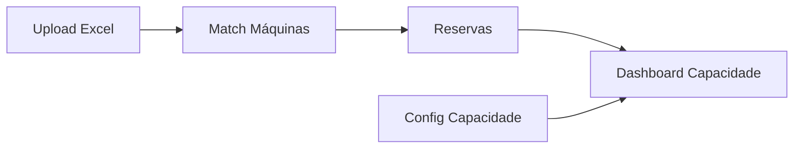
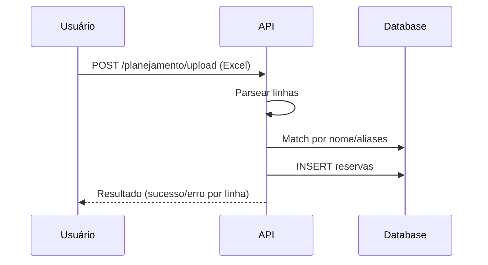

# Módulo de Planejamento

> **Responsável**: Gestão de capacidade de máquinas e reservas de produção.

---

## Visão Geral

O módulo de Planejamento permite upload de planilhas Excel com reservas de capacidade, visualização da ocupação das máquinas e configuração de capacidades.

---

## Rotas API

**Arquivo**: `apps/api/src/routes/planejamento/capacidade.ts`

| Método | Rota | Permissão | Descrição |
|--------|------|-----------|-----------|
| POST | `/planejamento/upload` | `planejamento_upload: editar` | Upload de Excel |
| GET | `/planejamento/uploads` | `planejamento_dashboard: ver` | Histórico |
| GET | `/planejamento/reservas` | `planejamento_dashboard: ver` | Listar reservas |
| GET | `/planejamento/capacidade` | `planejamento_config: ver` | Config de máquinas |
| PUT | `/planejamento/capacidade` | `planejamento_config: editar` | Atualizar capacidade |

---

## Páginas Frontend

**Pasta**: `apps/web/src/features/planejamento/pages/`

| Página | Arquivo | Descrição |
|--------|---------|-----------|
| **Dashboard** | `PlanejamentoDashboardPage.tsx` | Ocupação vs capacidade |
| **Upload** | `CapacidadeUploadPage.tsx` | Upload de planilhas |
| **Configurações** | `CapacidadeConfigPage.tsx` | Capacidade por máquina |

---

## Fluxo de Upload

---

## Regras de Negócio

1. **Match de máquinas**: Usa `aliases_planejamento` para encontrar a máquina correta.
2. **Capacidade**: Definida em horas por máquina (`maquinas.capacidade_horas`).
3. **Status de reservas**: `Criado`, `Liberado`, `Iniciado`.
4. **Ativo/Inativo**: Uploads podem ser desativados sem excluir dados.

---

## Links Relacionados

- [Schema](../DATABASE.md) - Tabelas `planejamento_uploads`, `planejamento_reservas`
- [Permissões](../PERMISSIONS.md) - `planejamento_*`
