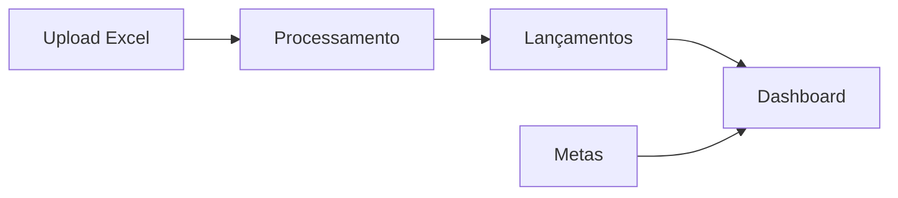

# Módulo de Produção

> **Responsável**: Dashboard de produção, upload de dados e gestão de metas.

---

## Visão Geral

O módulo de Produção gerencia o acompanhamento de horas produzidas por máquina, metas mensais e análise de variações.

---

## Rotas API

**Arquivo**: `apps/api/src/routes/producao/`

### Upload (`upload.ts`)

| Método | Rota | Permissão | Descrição |
|--------|------|-----------|-----------|
| POST | `/producao/upload` | `producao_upload: editar` | Upload de arquivo Excel |
| GET | `/producao/uploads` | - | Histórico de uploads |
| GET | `/producao/uploads/:id` | - | Detalhe do upload |

### Lançamentos (`lancamentos.ts`)

| Método | Rota | Descrição |
|--------|------|-----------|
| GET | `/producao/lancamentos` | Listar lançamentos |
| POST | `/producao/lancamentos` | Criar lançamento manual |
| PUT | `/producao/lancamentos/:id` | Atualizar |
| DELETE | `/producao/lancamentos/:id` | Excluir |

### Metas (`metas.ts`)

| Método | Rota | Permissão | Descrição |
|--------|------|-----------|-----------|
| GET | `/producao/metas` | `producao_config: ver` | Listar metas |
| POST | `/producao/metas` | `producao_config: editar` | Criar meta |
| PUT | `/producao/metas/:id` | `producao_config: editar` | Atualizar |
| DELETE | `/producao/metas/:id` | `producao_config: editar` | Excluir |
| GET | `/producao/indicadores/funcionarios/resumo` | `producao_colaboradores: ver` | Snapshot único (metas + realizado dia + realizado mês) para a tela de colaboradores |

---

## Páginas Frontend

**Pasta**: `apps/web/src/features/producao/pages/`

| Página | Arquivo | Descrição |
|--------|---------|-----------|
| **Dashboard** | `ProducaoDashboardPage.tsx` | Visão geral com gráficos |
| **Upload** | `ProducaoUploadPage.tsx` | Upload de Excel |
| **Detalhe Upload** | `ProducaoUploadDetalhePage.tsx` | Linhas processadas |
| **Configurações** | `ProducaoConfigPage.tsx` | Aliases e metas |
| **Colaboradores** | `ProducaoColaboradoresPage.tsx` | Análise por responsável |

---

## Regras de Negócio

1. **Match de máquinas**: Upload Excel faz match por nome ou `aliases_producao` da máquina.
2. **Sobrescrita**: Upload para data existente remove registros antigos antes de inserir novos.
3. **Metas**: Definidas por máquina/mês. Dashboard compara realizado vs meta.

---

## Links Relacionados

- [Schema](../DATABASE.md) - Tabelas `producao_lancamentos`, `producao_metas`
- [Permissões](../PERMISSIONS.md) - `producao_*`
