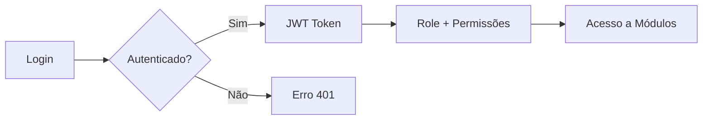

# Módulo de Usuários

> **Responsável**: Autenticação, gestão de usuários e controle de acesso.

---

## Visão Geral

O módulo Core gerencia autenticação, usuários e papéis. É a base do sistema de permissões granulares.

---

## Rotas API

**Arquivo**: `apps/api/src/routes/core/`

### Autenticação (`auth.ts`)

| Método | Rota | Descrição |
|--------|------|-----------|
| POST | `/auth/login` | Login com email/senha |
| POST | `/auth/reset-password` | Resetar senha |
| GET | `/auth/me` | Dados do usuário logado |

### Usuários (`usuarios.ts`)

| Método | Rota | Permissão | Descrição |
|--------|------|-----------|-----------|
| GET | `/usuarios` | - | Listar usuários |
| GET | `/usuarios/:id` | - | Detalhe |
| POST | `/usuarios` | `usuarios: editar` | Criar usuário |
| PUT | `/usuarios/:id` | `usuarios: editar` | Atualizar |
| DELETE | `/usuarios/:id` | `usuarios: editar` | Excluir |
| GET | `/usuarios/:id/estatisticas` | `usuarios: ver` | Stats do operador |

### Roles (`roles.ts`)

| Método | Rota | Permissão | Descrição |
|--------|------|-----------|-----------|
| GET | `/roles` | `roles: ver` | Listar papéis |
| GET | `/roles/:id` | `roles: ver` | Detalhe |
| POST | `/roles` | `roles: editar` | Criar papel |
| PUT | `/roles/:id` | `roles: editar` | Atualizar permissões |
| DELETE | `/roles/:id` | `roles: editar` | Excluir |

---

## Páginas Frontend

**Pasta**: `apps/web/src/features/usuarios/pages/`

| Página | Arquivo | Descrição |
|--------|---------|-----------|
| **Admin** | `AdminPage.tsx` | Gestão de usuários |
| **Roles** | `RolesPage.tsx` | Gestão de papéis |
| **Perfil** | `PerfilPage.tsx` | Dados do usuário logado |

---

## Fluxo de Autenticação

1. **Login**: POST `/auth/login` com `email` + `senha`
2. **Validação**: bcrypt compara hash
3. **Token**: Retorna JWT + dados do usuário + permissões do role
4. **Storage**: Frontend salva em `localStorage['usuario']`
5. **Requisições**: Header `Authorization: Bearer <token>`

---

## Regras de Negócio

1. **Roles do sistema**: `Admin`, `Operador` não podem ser excluídos (`is_system: true`).
2. **Admin bypass**: Role `admin` ignora todas as verificações de permissão.
3. **Operador auth**: Operadores podem logar só com matrícula (sem senha).
4. **Permissões herdadas**: Usuário herda permissões do seu role.

---

## Links Relacionados

- [Schema](../DATABASE.md) - Tabelas `usuarios`, `roles`
- [Permissões](../PERMISSIONS.md) - `usuarios`, `roles`
